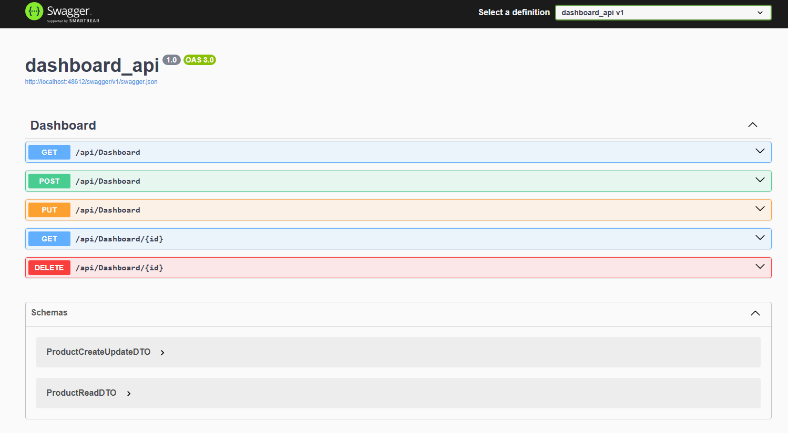
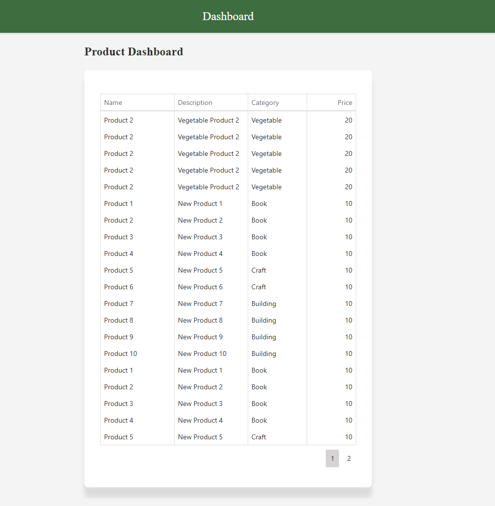
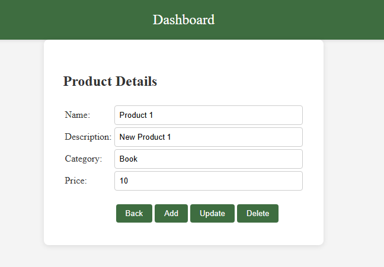

Dashboard Application with Angular Frontend and .NET Core Backend

# This project demonstrates a full-stack application featuring:
- Frontend: Angular-based dashboard leveraging DevExtreme UI components to visualize and interact with data.
- Backend: .NET Core API implementing CRUD operations with Entity Framework Core and MS SQL Database.
- Database: MS SQL Server as the data store for complex and large datasets.

# Frontend
- Interactive and user-friendly dashboard.
- Data visualization using native DevExtreme themes and components.
- Sorting, filtering, and drill-down capabilities.
- Real-time editing of data.
- Fully responsive design.

# Backend
- C# API to serve data to the Angular application.
- Basic CRUD operations for managing data.
- Implementation of Microsoft's Entity Framework as ORM.
- Unit Test for dashboard service using NUnit in console application.

# Database
- MS SQL Server with a schema designed.

# Prerequisites
- Frontend: Node.js (v16 or later), Angular CLI.
- Backend: .NET SDK (7.0 or later), MS SQL Server.
- Tools: Visual Studio Code or Visual Studio, SQL Server Management Studio (SSMS).

# Packages Installed
- Frontend: DevExtreme, Prettier, Eslint.
- Backend: Entity Framework, AutoMapper, Fluent Validation, Serilog.
- Backend Testing: NUnit, AutoMapper, NUnit3TestAdapter, Moq.

# Run Application
- Frontend: ng server - http://localhost:4200
- Backend: run using IIS Express - http://localhost:48612/swagger/index.html

# Screenshots

## Screenshot 1

## Screenshot 2

## Screenshot 3
